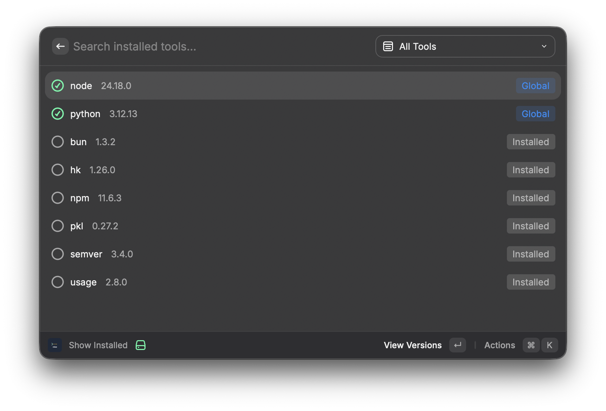
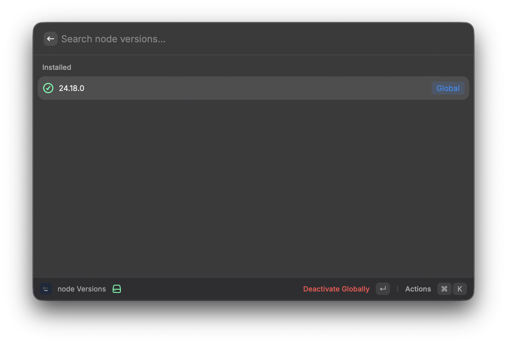
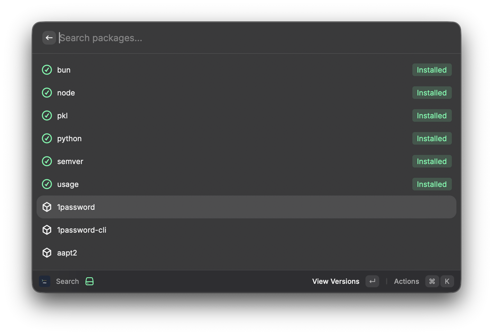
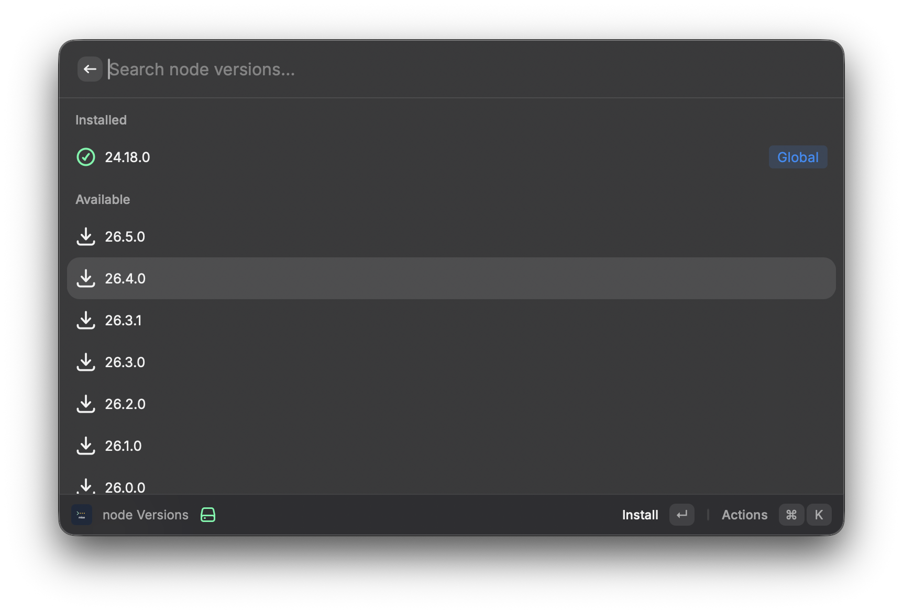

# Mise

A [Raycast](https://www.raycast.com/) extension for [mise](https://mise.en.dev/) — the polyglot tool & environment manager (formerly rtx).

Manage your development environments directly from Raycast without touching the terminal.






## Features

- **Show Installed** — View all installed tools with their versions, activation status (Global/Local), and manage them (activate, deactivate, uninstall)
- **Search** — Browse 700+ available packages from the mise registry, see which are installed, and install new versions
- **Version Management** — View all available versions for any tool, install specific versions, set global defaults
- **Smart Status Indicators** — Global (blue), Local (orange), Active (green) tags show where each tool version is configured

## Requirements

- [mise](https://mise.en.dev/) installed on your system
- Raycast installed on macOS

## Installation

1. Open Raycast
2. Search for "Store" or "Extension Store"
3. Search for "Mise"
4. Click "Install"

### Manual Installation

```bash
git clone https://github.com/ootws52/mise-raycast-extension.git
cd mise-raycast-extension
npm install
npm run build
```

Then in Raycast, search for "Import Extension" and select the `dist` folder.

## Configuration

After installation, configure the mise executable path in Raycast preferences:

1. Open Raycast → Search "Mise" → Open Preferences
2. Set **Mise Executable Path** (defaults to `/opt/homebrew/bin/mise`)

If mise is installed elsewhere, find it with:

```bash
which mise
```

## Commands

### Show Installed

Lists all installed tools with their versions. Press Enter on any tool to see all available versions.

- **Activate** — Set a version as the global default
- **Deactivate** — Remove the global pin (tool may remain active via local config)
- **Uninstall** — Remove an installed version

### Search

Browse all available packages from the mise registry. Installed packages are highlighted with a green indicator and sorted to the top.

- **View Versions** — See all available versions for a package
- **Install** — Download and install a specific version
- **Install & Use** — Install and immediately set as global default

## Development

```bash
npm install
npm run dev
```

This starts the extension in development mode. Changes auto-reload.

```bash
npm run lint        # Check for issues
npm run fix-lint    # Auto-fix issues
npm run build       # Build for production
```

## License

MIT
